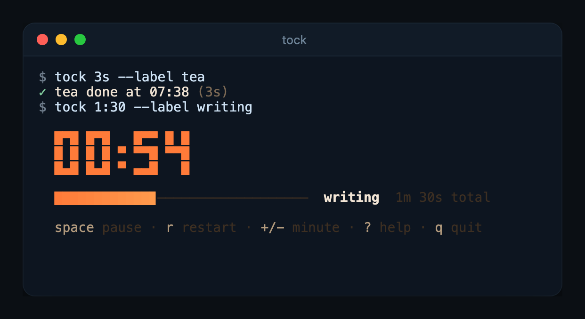

# tock

A pomodoro timer in your terminal.

tock counts down in a small pane under your prompt. When the time is up it
rings the terminal bell, leaves one line in your scrollback, and gets out of
the way.



## Install

```sh
cargo install --path .
```

tock is built on [kiln](https://github.com/Zfinix/kiln), which it finds at
`../kiln`. Clone kiln next to this repo before you build.

## Usage

```sh
tock                     # 25 minutes of focus
tock 10m                 # 10 minutes
tock 90s                 # 90 seconds
tock 1h30m               # an hour and a half
tock 1:30                # a minute and a half
tock 50m --label writing # name the session
tock 5m --theme nord     # pick a colour theme
tock --themes            # list the themes
```

When the time is up you get a line like this in your scrollback:

```
✓ writing done at 14:32 (50m)
```

If you quit early it says where you stopped instead:

```
· stopped focus at 12:04 of 25:00
```

tock exits with 0 either way. Bad input exits with 1 and says what to try.

### In scripts

`--quiet` (`-q`) leaves nothing in your scrollback. `--json` prints one line
of JSON when the timer ends:

```sh
tock 25m --json
{"label":"focus","planned_secs":1500,"elapsed_secs":1500,"completed":true}
```

`planned_secs` includes any minutes you added or took off, and `completed`
is `false` when you quit early. The pane draws on stdout, so run tock in a
terminal rather than with its output redirected.

## Keys

| Key | What it does |
|---|---|
| `space` | pause or resume |
| `r` | start the same length over |
| `+` / `-` | add or take off a minute |
| `?` | show or hide the key list |
| `q`, `ctrl+c` | quit |

## Configuration

| Setting | Flag | Environment | Default |
|---|---|---|---|
| Length | first argument | | `25m` |
| Label | `--label`, `-l` | | `focus` |
| Theme | `--theme`, `-t` | `TOCK_THEME` | `ember` |

Flags win over the environment, and the environment wins over the defaults.

## License

Licensed under the [Apache License, Version 2.0](LICENSE).
